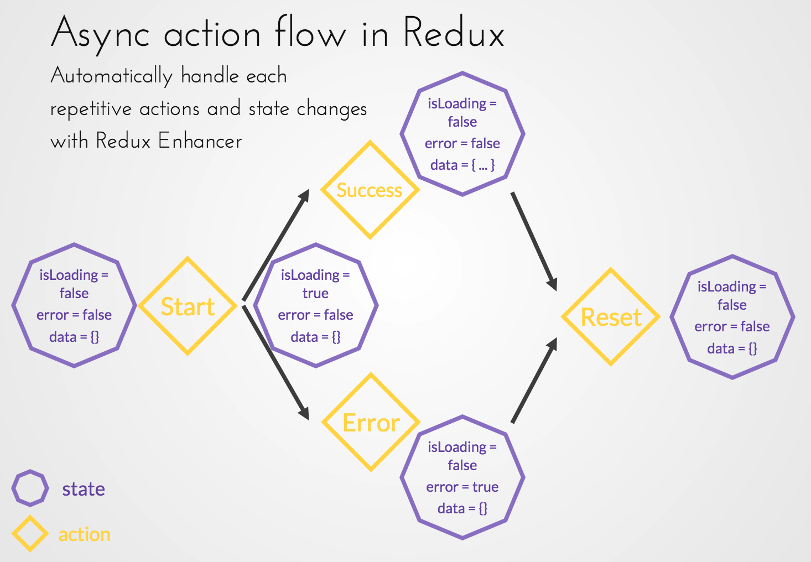

# Redux Enhancer

## What is it?

Tired of always copy pasting a lot of redux boilerplate everytime you create a
new store, or handle an async action?

* Automaticaly generate the state of your async actions!
* Automaticaly generate reset store

## But in depth?

Enhance your redux modules:



* Automaticaly handling the start, loading, error or success, and reset Redux
  phases of your async calls
  * Four action types will be automaticaly created such as:
    ```javascript
    {
      REQUEST: {
        SIGNUP: {
          START: `USER.REQUEST.SIGNUP.START`,
          SUCCESS: `USER.REQUEST.SIGNUP.SUCCESS`,
          FAILED: `USER.REQUEST.SIGNUP.FAILED`,
          RESET: `USER.REQUEST.SIGNUP.RESET`,
        },
      },
    }
    ```
  * Two states will be automaticaly added such as:
    ```javascript
    {
      requests: {
        LOGIN: {
          loading: true,
          failed: false,
        },
      },
    }
    ```
  * Two selectors corresponding to the state will be automaticaly generated such
    as:
    ```javascript
    {
      signupLoading: (state) => state.user.requests.LOGIN.loading,
      signupFailed: (state) => state.user.requests.LOGIN.failed,
    }
    ```
* Adding a `RESET_STORE` action to your different stores re-initializing your
  stores to their `defaultState`
  * An action type and action creator are generated:
    ```javascript
    {
      RESET_STORE: 'RESET_STORE';
    }
    {
      resetStore: () => ({ type: 'RESET_STORE' });
    }
    ```
  * Your enhanced reducer will handle automaticaly your stores reset when
    dispatching the action

## How to use? [Full example here](./documentation/fullCodeExample.js)

1. In your redux module file(s) import the necessary enhancers:

```javascript
import { enhanceActionTypes, enhanceActionCreators,
  enhanceDefaultState, enhanceReducer, enhanceSelectors } from 'redux-async-actions-factory';
...
```

2. Create two variables, a string for the name of your store, an array of string
   in caps for your async calls:

```javascript
...
const storeName = 'USER';
const asyncActionsNames = ['SIGNUP'];
...
```

3. Enhance your action types by passing the `storeName` and `asyncActionsNames`:

```javascript
...
const actionTypes = {
  ...enhanceActionTypes(storeName, asyncActionsNames),
  LOGOUT: 'LOGOUT',
};
...
```

4. Enhance your action creators by passing the `storeName`, `apiActionsNames`
   and `actionTypes`:

```javascript
...
const actionCreators = {
  ...enhanceActionCreators(storeName, asyncActionsNames, actionTypes),
  requestSignupStart: signupInfo => ({
    type: actionTypes.REQUEST.SIGNUP.START,
    payload: signupInfo,
  }),
};
...
```

5. Enhance your default state by passing the `asyncActionsNames`:

```javascript
...
const defaultState = {
  ...enhanceDefaultState(asyncActionsNames),
};
...
```

6. Create your normal reducer and enhance it afterwards by passing the
   `storeName`:

```javascript
...
const basicReducer = (state, action) => {
  switch (action.type) {
    case actionTypes.REQUEST.SIGNUP.SUCCESS:
      return {
        ...state,
        token: action.payload.token,
      };
    default:
      return state;
  }
};

const reducer = (state = defaultState, action) =>
  enhanceReducer(storeName, state, action, defaultState, basicReducer);
...
```

7. Enhance your selectors by passing the `storeName` and `asyncActionsNames`:

```javascript
...
const selectors = {
  ...enhanceSelectors(storeName, asyncActionsNames),
  token: (state) => state.user.token,
};
...
```

8. Use your newly generated actions and state inside your app:

```javascript
// In a container?
const mapStateToProps = state => ({
  signupLoading: selectors.signupLoading(state),
  signupFailed: selectors.signupFailed(state),
});
const mapDispatchToProps = {
  startSignup: actionCreators.startSignup,
  resetSignup: actionCreators.resetSignup,
};

// With a saga for instance
function* signupSaga(action) {
  try {
    const { email, password, nickname } = action.payload;
    const { token } = yield call(api.signup, email, password, nickname);
    yield put({ type: actionTypes.REQUEST.SIGNUP.SUCCESS, payload: { token } });
  } catch (err) {
    yield put({ type: actionTypes.REQUEST.SIGNUP.FAILED, payload: { err } });
  }
}
```

## Contributing

### Development

* Create a fork (or branch if you are part of the team)
* Develop your changes
* Open a pull request and ask for a review
* Someone from the team will merge if the changes are accepted

### Deployment

* Bump the version in the package.json and create a new commit
* Create a tag linked to the bump version commit: `git tag vX.Y.Z`
* Check that your tag was added locally: `git tag -l`
* Push your tag to Github: `git push origin vX.Y.Z`
* Verify in Github that there is a new release, and add a release note
* Publish to NPM now: `npm publish`
* Tada! After a few minutes, you will see the new version on NPM:
  https://www.npmjs.com/package/redux-async-actions-factory
